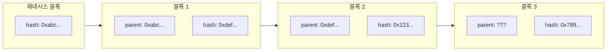
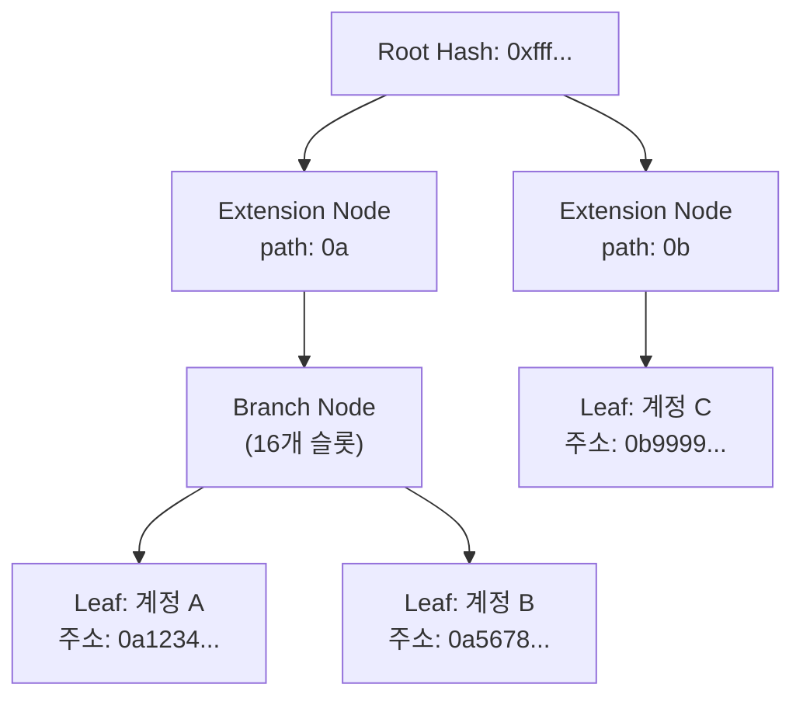

# Week 4 Quiz: Network/Block + wagmi

> **제출 방법:** 이 파일을 복사하여 답변을 작성한 후, PR로 제출하세요.
> **평가 기준:** 개념 이해도 중심 - 문법 오류보다 논리적 설명을 중시합니다.

---

## 문제 1: 블록 헤더 필드 (객관식)

다음 상황을 고려하세요:

```
블록 100의 해시: 0xabc123...
블록 101의 해시: 0xdef456...
```

블록 101의 `parentHash` 필드에는 어떤 값이 저장되어 있나요? 그리고 **왜** 이런 방식으로 연결하나요?

**보기:**
A) 0xdef456... - 자기 자신의 해시를 저장하여 무결성을 보장한다
B) 0xabc123... - 이전 블록의 해시를 저장하여 체인 연결과 불변성을 보장한다
C) 블록 번호 100 - 숫자로 순서를 추적한다
D) 빈 값 - 헤더에는 해시가 저장되지 않는다

**답변:**
<!--
정답 알파벳과 왜 이 답을 선택했는지 설명하세요.
다른 보기가 왜 틀린지도 간략히 설명해 주세요.
-->
B
과거 블록이 수정되면 더 이상 이후의 블록이 가리키는 parenthash와 수정된 과거블록의 해시가 같지 않으므로 연결이 끊어지기에 불변성을 보장한다.

A: 자기 해시를 저장하면 체인 연결이 불가능
C: 숫자 순서는 조작이 쉬워 보안이 안됨
D: 해시 연결이 있어야 불변 보장
---

## 문제 2: MPT 목적 (객관식)

이더리움에서 Merkle Patricia Trie(MPT)를 사용하는 **가장 중요한 이유**는 무엇인가요?

**보기:**
A) 데이터를 암호화하여 외부에서 읽을 수 없게 한다
B) 트랜잭션 처리 속도를 10배 이상 높인다
C) 전체 데이터 없이도 특정 데이터의 존재와 정확성을 효율적으로 증명한다
D) 블록 크기를 줄여서 저장 공간을 절약한다

**답변:**
<!--
정답 알파벳과 왜 이 기능이 중요한지 설명하세요.
Light Node와 연결지어 설명하면 더 좋습니다.
-->
C
MPT는 루트 해시 하나로 전체 상태 데이터의 보유가 필요없이 특정 계정 혹은 트랜잭션을 빠르게 검증가능하다.

이는 라이트 노드가 풀노드처럼 수백 GB의 데이터 필요없이 풀노드에 특정 데이터의 머클 증명만 요청해 루트해시랑 대조 시 빠르고 가벼운 검증을 할수 있게 해 저사양 환경도 참여가 가능하다.

---

## 문제 3: 체인 연결과 보안 (객관식)

공격자가 블록 50의 트랜잭션을 수정하려고 합니다. 현재 체인의 최신 블록은 100입니다. 이 공격이 **왜** 어려운가요?

**보기:**
A) 블록 50은 너무 오래되어서 시스템에서 접근할 수 없다
B) 블록 50을 수정하면 해시가 바뀌고, 블록 51부터 100까지 모든 블록의 parentHash가 불일치하게 된다
C) 블록 50은 이미 암호화되어 있어서 복호화 키가 필요하다
D) 네트워크 관리자만 과거 블록을 수정할 수 있다

**답변:**
<!--
정답 알파벳과 블록체인의 불변성이 어떻게 작동하는지 설명하세요.
-->
B
불변성은 위같은 경우
블록 50 수정 -> 50의 해시 변경 -> 51의 parenthash와 불일치 -> 51 재계산 -> 52와 불일치... -> 블록 100까지 모든 해시 재계산 필요

이런 상황으로 작동한다.
단 하나의 블록 변조만으로 이후 모든 블록을 재채굴해야하는데 나머지 네트워크가 놀고 있는게 아니라 새 블록을 동시에 같이 추가하므로 공격자가 따라잡는건 불가능이다.

---

## 문제 4: MPT 진화 과정 (단답형)

MPT(Merkle Patricia Trie)는 세 가지 자료구조의 장점을 결합한 것입니다:
1. **Trie** -> 2. **Patricia Trie** -> 3. **Merkle Patricia Trie**

**왜** 각 단계의 발전이 필요했나요? 각 단계가 해결하는 문제를 간단히 설명하세요.

**답변:**
<!--
1. Trie가 해결하는 문제:

2. Patricia Trie가 해결하는 문제 (Trie의 한계):

3. Merkle Patricia Trie가 해결하는 문제 (Patricia Trie의 한계):

-->
Trie를 트리 대신 사용함으로 접두사 기반 문자열 검색을 빠르게 처리할수있게 되었다. 이후 공통 접두사가 없는 긴 키에서 중간 노드가 낭비되는 trie의 단점을 보완하기 위해 단일 자식을 가지는 노드들을 간선 하나로 압축하는 patricia trie를 적용했지만, 데이터 무결성 검증 수단이 없었기에 MPT에서는 각 노드에 해시를 부여하고 루트 해시 하나로 전체 트리의 무결성을 증명할수 있게 했다.

---

## 문제 5: Eclipse Attack 방어 (단답형)

Eclipse Attack은 공격자가 피해자 노드의 **모든 피어 연결**을 자신이 통제하는 노드로 바꾸는 공격입니다.

1) 이 공격이 성공하면 피해자에게 **어떤 피해**가 발생할 수 있나요?
2) 개인 노드 운영자가 이 공격을 **방어**하기 위해 할 수 있는 행동은 무엇인가요?

**답변:**
<!--
1) 가능한 피해 (2가지 이상):


2) 방어 방법 (2가지 이상):

-->
1) 이중 지불 공격에 취약해지며, 동시에 트랜잭션이 검열될 가능성이 높아짐
2) 여러 ISP 노드에 분산 연결해 주변 모든 피어 장악이 어렵게 하거나, 신뢰가능한 정적 피어 노드 IP를 수동으로 추가해 강제 연결을 유지한다.

---

## 문제 6: 노드 종류 선택 (단답형)

친구가 이더리움 개발을 시작하려고 합니다. 다음 세 가지 상황에서 각각 어떤 노드 타입(Full, Light, Archive)을 추천하시겠습니까? **왜** 그 노드를 추천하는지도 설명하세요.

1) 모바일 지갑 앱 개발
2) 블록체인 데이터 분석 서비스 개발
3) 일반적인 dApp 백엔드 개발

**답변:**
<!--
1) 모바일 지갑 앱:
   추천 노드:
   이유:

2) 블록체인 데이터 분석:
   추천 노드:
   이유:

3) dApp 백엔드:
   추천 노드:
   이유:
-->
1) 라이트노드를 추천, 저장공간과 배터리가 제한적이므로 블록 헤더만 저장하고 풀노드로부터 머클 증명만 받아 검증하기에 요구사양이 낮다
2)아카이브 노드, 풀노드보다도 더 상세하게 제네시스 블록부터 지금까지 모든 상태 스냅샷을 보관하므로
3) 풀 노드, 현재 상태 조회/트랜잭션 제출/이벤트 수신 등 dapp에 필요한 기능을 모두 제공하기 때문
---

## 문제 7: useAccount Hook (빈칸 채우기)

다음 코드의 빈칸을 채워서 지갑 연결 상태를 표시하는 컴포넌트를 완성하세요:

```typescript
import { _________________ } from 'wagmi';

function WalletStatus() {
  // TODO: useAccount hook에서 필요한 값들을 가져오세요
  const { _________________, _________________ } = useAccount();

  if (!isConnected) {
    return <div>지갑이 연결되지 않았습니다</div>;
  }

  return (
    <div>
      <p>연결된 주소: {address}</p>
    </div>
  );
}
```

**답변:**
```typescript
// 완성된 코드를 여기에 작성하세요
import { useAccount } from 'wagmi';

function WalletStatus() {
  const { address, isConnected } = useAccount();

  if (!isConnected) {
    return <div>지갑이 연결되지 않았습니다</div>;
  }

  return (
    <div>
      <p>연결된 주소: {address}</p>
    </div>
  );
}
```

**왜 이렇게 작성했나요:**
<!--
useAccount hook이 제공하는 값들과 각각의 역할을 설명하세요.
-->
useAccount는 현재 연결된 지갑의 상태를 반환하는 훅으로, 주요 반환값은

address: 연결된 지갑의 이더리움 주소 (0x... 형식), 미연결 시 undefined
isConnected: 지갑 연결 여부를 나타내는 boolean

를 의미한다.

isConnected로 먼저 분기 처리를 해야 address가 undefined인 상태로 렌더링되는 것을 막을 수 있다.


---

## 문제 8: useReadContract Hook (빈칸 채우기)

다음 코드의 빈칸을 채워서 컨트랙트의 `getCount` 함수 결과를 화면에 표시하세요:

```typescript
import { useReadContract } from 'wagmi';

const counterABI = [
  {
    name: 'getCount',
    type: 'function',
    stateMutability: 'view',
    inputs: [],
    outputs: [{ name: 'count', type: 'uint256' }],
  },
] as const;

function CountDisplay() {
  const { data, isLoading, error } = useReadContract({
    // TODO: 필요한 설정을 채우세요
    address: '0x1234...5678',
    _________________,
    _________________,
  });

  if (isLoading) return <div>로딩 중...</div>;
  if (error) return <div>에러 발생</div>;

  return <div>현재 카운트: {_________________}</div>;
}
```

**답변:**
```typescript
// 완성된 코드를 여기에 작성하세요
import { useReadContract } from 'wagmi';

const counterABI = [
  {
    name: 'getCount',
    type: 'function',
    stateMutability: 'view',
    inputs: [],
    outputs: [{ name: 'count', type: 'uint256' }],
  },
] as const;

function CountDisplay() {
  const { data, isLoading, error } = useReadContract({
    address: '0x1234...5678',
    abi: counterABI,
    functionName: 'getCount',
  });

  if (isLoading) return <div>로딩 중...</div>;
  if (error) return <div>에러 발생</div>;

  return <div>현재 카운트: {data?.toString()}</div>;
}
```

**왜 이렇게 작성했나요:**
<!--
useReadContract의 필수 설정 항목과 data를 화면에 표시할 때 주의할 점을 설명하세요.
-->
abi: 컨트랙트 함수 시그니처를 정의한다. 없으면 어떤 함수를 호출할지 알수가 없음.
functionName: ABI 중 어떤 함수를 호출할지 지정
data?.toString(): uint256은 JavaScript의 BigInt로 반환되기에 그대로 렌더링하면 오류가 발생하므로 반드시 .toString()으로 변환해야 함. 옵셔널 체이닝(?.)으로 undefined 상태도 안전하게 처리

---

## 문제 9: useWriteContract 버그 (취약점 찾기)

다음 코드에서 **문제점**을 찾고 수정하세요:

```typescript
// BAD CODE - 문제점 찾기
import { useWriteContract } from 'wagmi';

function IncrementButton() {
  const { writeContract, isPending } = useWriteContract();

  const handleClick = () => {
    // 문제가 있는 코드
    writeContract({
      address: '0x1234...5678',
      functionName: 'increment',
      // abi가 없음!
    });
  };

  return (
    <button onClick={handleClick} disabled={isPending}>
      증가하기
    </button>
  );
}
```

**1) 발견한 문제점:**
<!--
무엇이 빠졌거나 잘못되었는지 설명하세요.
-->
writeContract 호출 시 abi 필드가 누락

**2) 왜 이것이 문제인가:**
<!--
이 문제가 어떤 오류나 동작 이상을 일으키는지 설명하세요.
-->
ABI(Application Binary Interface)가 없으면 wagmi가 increment 함수를 어떻게 인코딩해야 하는지 알 수 없고, 결과적으로 런타임 에러가 발생하거나, 잘못된 calldata가 생성되어 트랜잭션이 실패한다.

**3) 올바른 수정 방법:**
```typescript
// GOOD CODE - 수정된 버전을 작성하세요
import { useWriteContract } from 'wagmi';

const counterABI = [
  {
    name: 'increment',
    type: 'function',
    stateMutability: 'nonpayable',
    inputs: [],
    outputs: [],
  },
] as const;

function IncrementButton() {
  const { writeContract, isPending } = useWriteContract();

  const handleClick = () => {
    writeContract({
      address: '0x1234...5678',
      abi: counterABI,       // ✅ ABI 추가
      functionName: 'increment',
    });
  };

  return (
    <button onClick={handleClick} disabled={isPending}>
      증가하기
    </button>
  );
}
```

---

## 문제 10: 블록 연결 구조 (다이어그램 해석)

다음 다이어그램은 블록체인의 연결 구조를 보여줍니다:



**질문:**

1) 블록 3의 `parent: ???` 에 들어갈 값은 무엇인가요?
답 : 블록 2의 해시인 0x123...

2) 만약 블록 1의 내용이 수정되면, 블록 2와 블록 3에 **어떤 영향**이 있나요? 왜 그런가요?
답 : 블록 1의 내용이 바뀌면 블록 1의 해시(0xdef...)가 달라진다. 그런데 블록 2의 `parentHash`는 `0xdef...`를 참조하고 있으므로 불일치가 발생하고, 블록 2를 유효하게 만들려면 블록 2도 재계산해야 하고, 그러면 블록 2의 해시도 바뀌어 블록 3도 연쇄적으로 무효화가 되어 결국 체인의 불변성이 깨진다.

3) 제네시스 블록(블록 0)의 parentHash는 어떤 특별한 값을 가지나요? 왜 그런가요?
답 : 0x000...000 (32바이트 전부 0)를 가진다. 제네시스 블록은 체인의 시작점으로 이전 블록이 없다.. 따라서 "부모 없음"을 나타내기 위한 관례적 값으로 모두 0으로 채워진 해시를 사용한다

---

## 문제 11: MPT 트리 구조 (다이어그램 해석)

다음 다이어그램은 MPT의 노드 구조를 보여줍니다:



**질문:**

1) 계정 A와 계정 B가 같은 Branch Node 아래에 있는 이유는 무엇인가요? (주소 패턴을 힌트로 사용하세요)
답 : 두 계정의 주소가 공통 접두사 `0a`를 공유하기 때문이다.
- 계정 A: `0a1234...`
- 계정 B: `0a5678...`

Extension Node가 공통 경로 `0a`를 압축해 처리하고, 그 이후 `1`, `5`로 분기하는 Branch Node가 두 계정을 각각의 Leaf Node로 연결한다

2) Extension Node가 하는 역할은 무엇인가요? 없다면 어떤 문제가 생기나요?
답 : 여러 노드가 공통된 경로(접두사)를 공유할 때, 그 부분을 하나의 노드로 압축합니다. Extension Node가 없다면 `0a`라는 두 글자를 위해 중간 노드를 2개 거쳐야 하고, 더 긴 공통 접두사일수록 불필요한 중간 노드가 폭발적으로 증가할 수 있다. Extension Node는 이를 단일 노드로 압축해 트리 깊이와 메모리를 절약한다.

3) Root Hash만 알면 어떻게 특정 계정의 데이터 존재를 **증명**할 수 있나요? (Light Client 관점에서)
답:
Light Client는 Root Hash만 보유한다. 특정 계정 데이터를 증명하려면 다음 과정을 거친다
```
1.Full Node에 "계정 X의 Merkle Proof"를 요청
2.Full Node가 루트 → 해당 Leaf까지의 경로상 모든 노드 해시를 반환
3.Light Client가 각 노드 해시를 직접 계산하며 올라가,
   최종적으로 계산된 루트 해시 == 자신이 보유한 Root Hash 인지 검증
4.일치하면 해당 데이터는 변조되지 않은 것으로 증명됨
```
---

## 제출 전 체크리스트

- [x] 모든 문제에 답변을 작성했는가?
- [x] 객관식 문제: 정답 선택 **이유**를 설명했는가?
- [x] 단답형 문제: 2-3문장 이상으로 충분히 설명했는가?
- [x] 코드 문제: 완성된 코드와 **왜 그렇게 작성했는지** 설명했는가?
- [x] 다이어그램 문제: 각 질문에 논리적으로 답변했는가?
