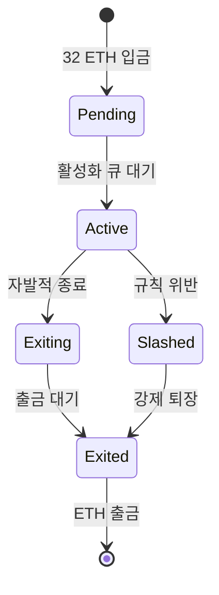
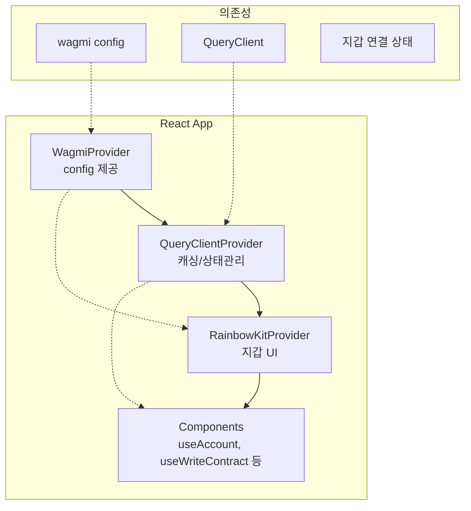

# Week 5 Quiz: PoS/Consensus + RainbowKit

> **제출 방법:** 이 파일을 복사하여 답변을 작성한 후, PR로 제출하세요.
> **평가 기준:** 개념 이해도 중심 - 문법 오류보다 논리적 설명을 중시합니다.

---

## 문제 1: PoS 개념 (객관식)

이더리움이 PoW(작업 증명)에서 PoS(지분 증명)로 전환한 **가장 주요한 이유**는 무엇인가요?

**보기:**
A) 트랜잭션 처리 속도를 10배 이상 높이기 위해
B) 에너지 소비를 99.95% 이상 줄이고 환경 친화적으로 만들기 위해
C) 블록 크기를 늘려서 더 많은 데이터를 저장하기 위해
D) 채굴 장비 없이도 누구나 블록을 생성할 수 있게 하기 위해

**답변:**
<!--
정답 알파벳과 왜 이 답을 선택했는지 설명하세요.
PoW의 문제점과 PoS의 해결책을 연결지어 설명하면 더 좋습니다.
-->
B
PoW의 가장 큰 문제점은 막대한 에너지 소비였다. PoS로 전환하면서 이더리움은 에너지 소비를 약 99.95% 줄였다.

---

## 문제 2: 검증자 역할 (객관식)

이더리움 PoS에서 검증자(Validator)가 수행하는 **두 가지 주요 역할**은 무엇인가요?

**보기:**
A) 블록 채굴(Mining)과 가스 가격 결정
B) 블록 제안(Proposing)과 블록 증명(Attesting)
C) 트랜잭션 전송과 수수료 수집
D) 스마트 컨트랙트 배포와 실행

**답변:**
<!--
정답 알파벳과 각 역할이 무엇을 의미하는지 설명하세요.
-->
B
블록 제안(Proposing): 슬롯마다 무작위로 선택된 검증자 1명이 새 블록을 제안
블록 증명(Attesting): 나머지 검증자들이 제안된 블록이 유효한지 서명(투표)으로 증명. 이 증명이 모여 블록이 최종 확정됨

---

## 문제 3: 왜 PoW에서 PoS로? (단답형)

PoW(작업 증명)와 PoS(지분 증명)의 **핵심 차이점**은 무엇인가요?
"자격 증명 방식"과 "보안 보장 방식" 두 관점에서 각각 비교하세요.

**답변:**
<!--
자격 증명 방식:
- PoW:
- PoS:

보안 보장 방식:
- PoW:
- PoS:
-->
자격 증명 방식:

PoW: 컴퓨팅 파워(해시 연산 능력)로 자격을 증명. 가장 많은 계산을 한 사람이 블록 생성권 획득
PoS: 경제적 지분(스테이킹된 ETH)으로 자격을 증명. 32 ETH를 예치한 검증자 중 무작위 선택

보안 보장 방식:

PoW: 공격자가 네트워크의 51% 이상의 해시파워(채굴 장비)를 확보해야 공격 가능 → 물리적 비용이 방어막
PoS: 공격자가 전체 스테이킹 ETH의 1/3 이상을 보유해야 공격 가능 → 슬래싱으로 공격 시 ETH 몰수, 경제적 손실이 방어막

---

## 문제 4: 슬래싱의 목적 (단답형)

슬래싱(Slashing)은 검증자의 스테이킹된 ETH를 **강제로 소각**하는 패널티입니다.

1) 슬래싱이 발동되는 **두 가지 조건**은 무엇인가요?
2) **왜** 이런 처벌이 필요한가요? 없다면 어떤 문제가 생길 수 있나요?

**답변:**
<!--
1) 슬래싱 조건 (2가지):
   -
   -

2) 슬래싱이 필요한 이유:

-->
발생하는 2가지 조건은

- 이중 투표(Double Voting): 같은 슬롯에서 서로 다른 두 블록에 동시에 서명(증명)하는 행위
- 둘러싸기 투표(Surround Voting): 이전에 투표한 체크포인트를 감싸는 방식으로 모순된 투표를 하는 행위 (체인 재편을 시도)

이고

슬래싱이 없다면 검증자는 아무런 손해 없이 악의적인 행동(이중 서명, 체인 재편 시도 등)을 할 수 있기에 "공격에 실패해도 잃을 것이 없다"면 공격 시도를 막을 수단이 없다.
슬래싱은 경제적 패널티(스테이킹 ETH 소각 + 강제 퇴출)를 부과함으로써, 악의적 행동의 기대 비용을 기대 이익보다 훨씬 크게 만들어 공격 자체를 억제하는 기능을 한다.

---

## 문제 5: 체인 선택 규칙 (단답형)

여러 유효한 블록이 동시에 제안되면 **포크(Fork)**가 발생합니다.
이더리움의 LMD-GHOST(Latest Message Driven GHOST) 규칙은 어떻게 "정규 체인"을 선택하나요?

1) LMD-GHOST의 기본 원리는 무엇인가요?
2) **왜** "가장 최근 메시지"를 사용하나요? (오래된 메시지를 사용하면 어떤 문제가?)

**답변:**
<!--
1) LMD-GHOST 원리:


2) 최근 메시지 사용 이유:

-->
원리:
포크가 발생했을 때, 각 검증자가 보낸 가장 최근 메시지(투표)만 기준으로, 분기점에서 누적 투표 수가 가장 많은 쪽의 가지를 계속 따라가며 정규 체인을 선택

오래된 메시지를 그대로 유지하면 검증자가 오래전 상태에 투표한 내용이 계속 영향을 미친다. 네트워크 지연으로 뒤늦게 받은 블록에 투표한 내용이 현재 체인 선택을 왜곡할 수가 있다.
"가장 최근 메시지"만 사용하면 각 검증자의 현재 관점이 반영되어, 네트워크의 최신 합의 상태의 정확한 추적이 가능하다.

---

## 문제 6: RainbowKit Provider 계층 (빈칸 채우기)

다음 코드의 빈칸을 채워서 RainbowKit을 올바르게 설정하세요.
**Provider 순서가 중요합니다!**

```typescript
'use client';

// TODO: 필요한 스타일 import
_________________________________________

import { RainbowKitProvider } from '@rainbow-me/rainbowkit';
import { WagmiProvider } from 'wagmi';
import { QueryClientProvider, QueryClient } from '@tanstack/react-query';
import { config } from '@/config/wagmi';

const queryClient = new QueryClient();

export default function RootLayout({ children }) {
  return (
    <html lang="ko">
      <body>
        {/* TODO: Provider를 올바른 순서로 중첩하세요 */}
        <_________________ config={config}>
          <_________________ client={queryClient}>
            <_________________>
              {children}
            </_________________>
          </_________________>
        </_________________>
      </body>
    </html>
  );
}
```

**답변:**
```typescript
// 완성된 코드를 여기에 작성하세요
'use client';

import '@rainbow-me/rainbowkit/styles.css'; // ← 스타일 import

import { RainbowKitProvider } from '@rainbow-me/rainbowkit';
import { WagmiProvider } from 'wagmi';
import { QueryClientProvider, QueryClient } from '@tanstack/react-query';
import { config } from '@/config/wagmi';

const queryClient = new QueryClient();

export default function RootLayout({ children }) {
  return (
    <html lang="ko">
      <body>
        <WagmiProvider config={config}>
          <QueryClientProvider client={queryClient}>
            <RainbowKitProvider>
              {children}
            </RainbowKitProvider>
          </QueryClientProvider>
        </WagmiProvider>
      </body>
    </html>
  );
}
```

**왜 이 순서인가요:**
<!--
Provider 순서가 왜 중요한지 설명하세요.
순서가 잘못되면 어떤 오류가 발생하나요?
-->
우선 wagmiprovider는 wagmi config(체인, 커넥터 등)를 전체 앱에 제공하며 모든 것의 기반이 되기에 제일 먼저 감싸야하고
QueryClientProvider는 wagmi 훅들이 내부적으로 TanStack Query를 사용해 데이터를 캐싱/패칭하므로 wagmi 안에 있어야 한다
RainbowKitProvider가 마지막인 이유는 지갑 UI를 렌더링할 때 wagmi의 연결 상태와 Query 캐시 모두 필요하기 때문이다.

순서가 잘못되면 "No QueryClient set" 또는 "WagmiContext not found" 같은 Context 오류가 난다

---

## 문제 7: Provider 순서 버그 (취약점 찾기)

다음 코드에서 **문제점**을 찾고 수정하세요:

```typescript
// BAD CODE - 문제점 찾기
'use client';

import '@rainbow-me/rainbowkit/styles.css';
import { RainbowKitProvider } from '@rainbow-me/rainbowkit';
import { WagmiProvider } from 'wagmi';
import { QueryClientProvider, QueryClient } from '@tanstack/react-query';
import { config } from '@/config/wagmi';

const queryClient = new QueryClient();

export default function Providers({ children }) {
  return (
    // 문제가 있는 Provider 순서!
    <QueryClientProvider client={queryClient}>
      <RainbowKitProvider>
        <WagmiProvider config={config}>
          {children}
        </WagmiProvider>
      </RainbowKitProvider>
    </QueryClientProvider>
  );
}
```

**1) 발견한 문제점:**
<!--
무엇이 잘못되었는지 설명하세요.
-->
WagmiProvider가 RainbowKitProvider보다 안쪽에 있다.즉 QueryClientProvider → RainbowKitProvider → WagmiProvider 순서로 잘못 중첩되어 있다

**2) 왜 이것이 문제인가:**
<!--
이 순서로 인해 어떤 오류가 발생하는지 설명하세요.
-->
RainbowKitProvider는 렌더링될 때 wagmi의 Context(연결된 계정, 체인 정보 등)가 이미 존재해야 함
하지만 현재 순서에서는 RainbowKitProvider가 WagmiProvider보다 바깥에 있어서, wagmi Context가 아직 생성되지 않은 상태에서 RainbowKit이 그것을 참조하려 한다
결과로 "WagmiContext not found" 또는 "Cannot read properties of undefined"같은 오류가 발생한다


**3) 올바른 수정 방법:**
```typescript
// GOOD CODE - 수정된 버전을 작성하세요
// GOOD CODE
'use client';

import '@rainbow-me/rainbowkit/styles.css';
import { RainbowKitProvider } from '@rainbow-me/rainbowkit';
import { WagmiProvider } from 'wagmi';
import { QueryClientProvider, QueryClient } from '@tanstack/react-query';
import { config } from '@/config/wagmi';

const queryClient = new QueryClient();

export default function Providers({ children }) {
  return (
    <WagmiProvider config={config}>          {/* 1. 가장 바깥 */}
      <QueryClientProvider client={queryClient}> {/* 2. 중간 */}
        <RainbowKitProvider>                 {/* 3. 가장 안쪽 */}
          {children}
        </RainbowKitProvider>
      </QueryClientProvider>
    </WagmiProvider>
  );
}
```

---

## 문제 8: 트랜잭션 상태 처리 (빈칸 채우기)

다음 코드의 빈칸을 채워서 트랜잭션 전송 후 **확인 상태를 추적**하세요:

```typescript
'use client';

import { useWriteContract, _________________ } from 'wagmi';

const abi = [
  {
    name: 'increment',
    type: 'function',
    stateMutability: 'nonpayable',
    inputs: [],
    outputs: [],
  },
] as const;

function IncrementButton() {
  const { writeContract, data: hash, isPending } = useWriteContract();

  // TODO: 트랜잭션 확인 상태를 추적하는 hook
  const { isLoading: isConfirming, isSuccess } = _________________({
    _________________,
  });

  return (
    <div>
      <button
        onClick={() =>
          writeContract({
            address: '0x1234...5678',
            abi,
            functionName: 'increment',
          })
        }
        disabled={isPending || isConfirming}
      >
        {isPending ? '서명 대기 중...' : isConfirming ? '확인 중...' : '증가'}
      </button>

      {isSuccess && <p>트랜잭션 성공!</p>}
    </div>
  );
}
```

**답변:**
```typescript
// 완성된 코드를 여기에 작성하세요
'use client';

import { useWriteContract, useWaitForTransactionReceipt } from 'wagmi'; // ← 추가

const abi = [
  {
    name: 'increment',
    type: 'function',
    stateMutability: 'nonpayable',
    inputs: [],
    outputs: [],
  },
] as const;

function IncrementButton() {
  const { writeContract, data: hash, isPending } = useWriteContract();

  const { isLoading: isConfirming, isSuccess } = useWaitForTransactionReceipt({
    hash, // ← writeContract가 반환한 tx hash를 전달
  });

  return (
    <div>
      <button
        onClick={() =>
          writeContract({
            address: '0x1234...5678',
            abi,
            functionName: 'increment',
          })
        }
        disabled={isPending || isConfirming}
      >
        {isPending ? '서명 대기 중...' : isConfirming ? '확인 중...' : '증가'}
      </button>

      {isSuccess && <p>트랜잭션 성공!</p>}
    </div>
  );
}
```

**트랜잭션 상태 흐름을 설명하세요:**
<!--
1) isPending 상태:
2) isConfirming 상태:
3) isSuccess 상태:
-->
isPending (서명 대기 중): writeContract()를 호출한 후, 사용자가 지갑(MetaMask 등)에서 서명을 완료하기까지의 상태. 아직 트랜잭션이 네트워크에 제출되지 않음
isConfirming (확인 중): 서명 완료 후 tx hash를 받아 트랜잭션이 네트워크에 브로드캐스트된 상태. 블록에 포함되어 충분한 확인(confirmation)을 받기까지 대기 중
isSuccess (성공): 트랜잭션이 블록에 포함되고 영수증(receipt)이 확인된 상태. 체인에 상태 변경이 완료됨

---

## 문제 9: 검증자 생애주기 (다이어그램 해석)

다음 다이어그램은 이더리움 검증자의 생애주기를 보여줍니다:



**질문:**

1) **Active** 상태에서 검증자가 수행하는 주요 활동은 무엇인가요?
- 블록 제안(Proposing): 무작위로 선택될 경우 새 블록을 생성하고 제안
- 블록 증명(Attesting): 매 에포크마다 위원회에 배정되어 다른 검증자가 제안한 블록의 유효성을 서명으로 증명

2) Active에서 **Slashed**로 전이되는 조건은 무엇인가요? 이 경우 검증자에게 어떤 일이 발생하나요?
이중 투표 또는 둘러싸기 투표 등 명백한 프로토콜 위반이 감지되면 슬래싱이 발동함

발생하는 것은
- 스테이킹된 ETH의 일부(최소 1/32)가 즉시 소각
- 강제로 Exiting 상태로 전환되어 네트워크에서 퇴출
- 퇴출 대기 기간 동안 추가 패널티가 누적될 수 있음

3) 검증자가 자발적으로 종료(**Exiting**)하려면 왜 바로 ETH를 출금할 수 없고 대기 기간이 필요한가요?
검증자가 종료를 선언한 직후 바로 ETH를 빼갈 수 있다면, 악의적인 행동을 저지르고 패널티를 피해 즉시 탈출하는 악용이 가능하다.대기 기간(약 27시간~며칠)은 해당 검증자가 Active였던 시간 동안의 행동을 검증하고, 뒤늦게 발견된 위반에 대해 슬래싱을 적용할 시간을 확보하기 위해 꼭 필요함

---

## 문제 10: Provider 계층 구조 (다이어그램 해석)

다음 다이어그램은 RainbowKit/wagmi 앱의 Provider 구조를 보여줍니다:



**질문:**

1) **WagmiProvider**가 가장 바깥에 있어야 하는 이유는 무엇인가요?
wagmi config는 어떤 체인에 연결하는지, 어떤 커넥터(MetaMask, WalletConnect 등)를 사용하는지 등 전체 앱의 Web3 기반 설정을 담고 있다. QueryClientProvider와 RainbowKitProvider 모두 wagmi의 Context에 의존하기 때문에, wagmi가 먼저 Context를 제공해야 하위 Provider들이 정상 작동할 수 있다

2) **QueryClientProvider**의 역할은 무엇인가요? 없다면 어떤 문제가 발생하나요?
TanStack Query의 캐싱 및 비동기 상태 관리를 제공, wagmi의 훅들(useAccount, useBalance 등)은 내부적으로 TanStack Query를 사용해 블록체인 데이터를 페칭/캐싱/동기화

없다면: "No QueryClient set, use QueryClientProvider to set one" 오류가 발생하며 모든 wagmi 훅이 동작하지 않음

3) 아래 코드에서 `useAccount()` hook이 **"Cannot find WagmiContext"** 오류를 발생시키는 이유는 무엇인가요?

```typescript
// 오류 발생 코드
<QueryClientProvider>
  <RainbowKitProvider>
    <WagmiProvider>  {/* WagmiProvider가 안쪽에 있음 */}
      <MyComponent />  {/* useAccount() 호출 */}
    </WagmiProvider>
  </RainbowKitProvider>
</QueryClientProvider>
```
useAccount()는 WagmiProvider가 제공하는 Context를 useContext(WagmiContext)로 읽는데, React의 Context는 자신을 제공하는 Provider의 자식 컴포넌트에서만 접근 가능하다
위 코드에서 RainbowKitProvider는 WagmiProvider의 바깥에 위치하므로, RainbowKit이 렌더링될 때 WagmiContext가 아직 없다. MyComponent에서 useAccount()를 호출하면 Context 값이 undefined가 되어 오류가 발생함

---

## 제출 전 체크리스트

- [X] 모든 문제에 답변을 작성했는가?
- [x] 객관식 문제: 정답 선택 **이유**를 설명했는가?
- [x] 단답형 문제: 2-3문장 이상으로 충분히 설명했는가?
- [x] 코드 문제: 완성된 코드와 **왜 그렇게 작성했는지** 설명했는가?
- [x] 다이어그램 문제: 각 질문에 논리적으로 답변했는가?
