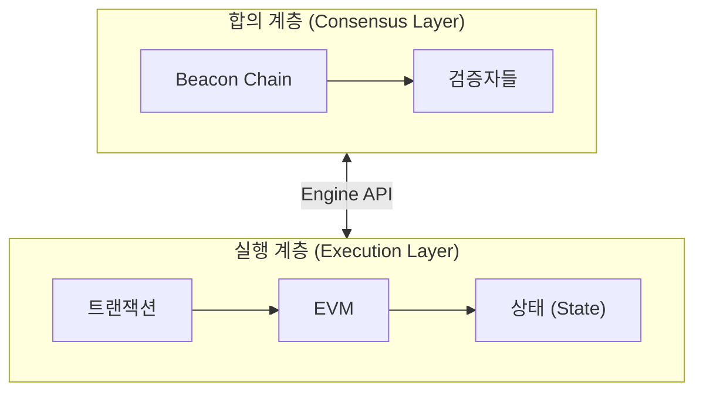
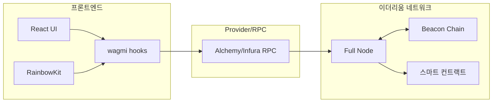

# Week 6 Quiz: Beacon Chain/Finality + Final Project Integration

> **제출 방법:** 이 파일을 복사하여 답변을 작성한 후, PR로 제출하세요.
> **평가 기준:** 개념 이해도 중심 - 6주간 배운 내용을 **통합**하여 설명하세요.

---

## 문제 1: Beacon Chain 역할 (객관식)

Beacon Chain의 **주요 역할**은 무엇인가요?

**보기:**
A) 스마트 컨트랙트를 실행하고 상태를 관리한다
B) 검증자를 관리하고 합의를 조정하며 블록 최종성을 결정한다
C) 트랜잭션 수수료를 계산하고 분배한다
D) 사용자의 지갑을 생성하고 개인키를 관리한다

**답변:**
<!--
정답 알파벳과 Beacon Chain이 "합의 계층(Consensus Layer)"으로서 하는 역할을 설명하세요.
실행 계층(Execution Layer)과의 차이도 언급하면 더 좋습니다.
-->
B
실행 계층에서 스마트 컨트랙트를 실행하고 트랜잭션 처리를 하는 반면,
합의 계층으로서 비콘 체인은 검증자 등록/관리, PoS 합의 조정, 블록 Finality 결정을 담당한다.

---

## 문제 2: Finality 개념 (객관식)

이더리움에서 **Finality(최종성)**가 달성되면 어떤 상태인가요?

**보기:**
A) 트랜잭션이 mempool에 들어간 상태
B) 블록이 체인에 추가되었지만 아직 재조직(reorg)될 수 있는 상태
C) 전체 검증자의 1/3 이상이 슬래싱되지 않는 한 절대 변경되지 않는 상태
D) 24시간이 지나서 트랜잭션이 만료된 상태

**답변:**
<!--
정답 알파벳과 왜 "1/3 이상 슬래싱"이 조건인지 설명하세요.
Finality가 왜 중요한지도 언급하세요.
-->
C
Finality는 이 블록이 절대 되돌려지지 않음이 보장된 상태를 의미한다
Casper FFG는 전체 검증자의 2/3 이상이 체크포인트에 투표해야 Finality를 달성하는데, 이게 무효화되려면 정당하지 않은 투표 혹은 이중 투표여야 하므로 서로 다른 2개 블록에 각각 2/3 이상의 투표가 이루어진 경우 수학적으로 1/3 이상은 무조건 2개 블록에 이중투표한 부정행위자이기에
1/3 이상 슬래싱이어야만 Finality가 깨질 수 있는 것이다.

---

## 문제 3: 왜 Finality가 중요한가 (단답형)

거래소나 dApp 개발자에게 **Finality**가 왜 중요한가요?
다음 시나리오를 예로 들어 설명하세요:

> 사용자가 거래소에 100 ETH를 입금하고, 거래소가 확인 후 내부 잔액에 반영했습니다.
> 그런데 나중에 블록 재조직(reorg)이 발생하여 입금 트랜잭션이 사라졌습니다.

**답변:**
<!--
1) 위 시나리오에서 거래소에 어떤 문제가 발생하나요?

2) Finality가 있으면 이 문제가 어떻게 해결되나요?

3) 이더리움에서 Finality까지 얼마나 기다려야 하나요?
-->
1 - 입금 트랜잭션이 사라졌지만 거래소가 이미 내부 잔액을 반영했으므로 실제 ETH를 받지 못한 채 사용자에게 잔액을 허용하게 됨
2 - Finality가 달성된 블록의 트랜잭션은 절대 취소되지 않으므로, 거래소는 Finality 이후에만 잔액을 반영하면 됨
3 - 이더리움에서 Finlaity는 약 2 Epoch인 12 * 32 * 2 = 12분 48초 후 달성됨

---

## 문제 4: 포크 선택 규칙 (단답형)

이더리움은 **Casper FFG**와 **LMD-GHOST** 두 가지 메커니즘을 결합합니다.
각각의 역할은 무엇이며, **왜** 둘 다 필요한가요?

**답변:**
<!--
1) Casper FFG의 역할:

2) LMD-GHOST의 역할:

3) 왜 둘 다 필요한가 (한쪽만 있으면 어떤 문제?):
-->
Casper FFG는 순서대로 연결된 체크포인트 쌍(source → target)에 2/3 이상 투표가 모이면 확정(finailize)시키고,
LMD-GHOST는 매 slot마다 기존 attestation들을 집계해 가장 많은 지지를 받는 분기를 따라 현재의 canonical head 블록을 결정

LMD GHOST가 없으면 Casper FFG가 체크포인트로 삼을 체인 자체가 수렴되지 않고,
Casper FFG가 없으면 LMD GHOST가 선택한 체인이 언제든 뒤집힐 수 있다
---

## 문제 5: dApp 아키텍처 설계 (코드/아키텍처 문제)

당신은 "간단한 투표 dApp"을 만들려고 합니다.
다음 요구사항을 읽고 **컴포넌트 구조**와 **사용할 hook**들을 설계하세요.

**요구사항:**
- 사용자가 지갑을 연결할 수 있다
- 현재 투표 현황(찬성/반대 수)을 조회할 수 있다
- 사용자가 찬성 또는 반대 투표를 할 수 있다
- 투표 후 결과가 화면에 즉시 반영된다

**답변:**

```
1) 컴포넌트 구조 (어떤 컴포넌트가 필요한가):
지갑 연결 버튼, 현재 투표 현황판(찬성 수 + 반대 수), 찬성 버튼, 반대 버튼, 상태 프로바이더

2) 각 컴포넌트에서 사용할 wagmi/RainbowKit hook:
   - 지갑 연결: ConnectButton + useAccount
   - 투표 현황 조회: useReadContract
   - 투표 실행: useWriteContract
   - 트랜잭션 확인: useWaitForTransactionReceipt


3) Provider 계층 구조:
WagmiProvider
- QueryClientProvider
- - RainbowKitProvider
```

**왜 이렇게 설계했나요:**
<!--
각 hook의 선택 이유와 데이터 흐름을 설명하세요.
-->
투표를 스마트 컨트랙트로 구현 시 조회는 컨트랙트를 읽어야 하므로 useReadContract, 투표 실행(각자 찬성/반대)은 스마트 컨트랙트를 실행해야하므로 useWriteContract를 사용한다. 지갑 연결 시 연결 버튼으로 ConnectButton, 지갑 연결 여부를 보여주거나 이용해 비활성화 시키기 위해 useAccount로 public key 유무를 읽어온다. 트랜잭션이 블록에 확정된 것을 확인하고 아니라면 에러를 돌려주도록 useWaitForTransactionReceipt를 활용한다.

---

## 문제 6: 컨트랙트-프론트엔드 연동 (빈칸 채우기)

다음 코드의 빈칸을 채워서 투표 컨트랙트와 프론트엔드를 연동하세요:

**Solidity 컨트랙트:**
```solidity
contract Voting {
    uint256 public yesVotes;
    uint256 public noVotes;

    function voteYes() external {
        yesVotes += 1;
    }

    function voteNo() external {
        noVotes += 1;
    }
}
```

**React 컴포넌트:**
```typescript
import { useReadContract, useWriteContract, _________________ } from 'wagmi';

const votingABI = [
  { name: 'yesVotes', type: 'function', stateMutability: 'view', inputs: [], outputs: [{ type: 'uint256' }] },
  { name: 'noVotes', type: 'function', stateMutability: 'view', inputs: [], outputs: [{ type: 'uint256' }] },
  { name: 'voteYes', type: 'function', stateMutability: 'nonpayable', inputs: [], outputs: [] },
  { name: 'voteNo', type: 'function', stateMutability: 'nonpayable', inputs: [], outputs: [] },
] as const;

function VotingApp() {
  // 찬성 투표 수 조회
  const { data: yesCount, refetch: refetchYes } = useReadContract({
    address: '0x1234...5678',
    abi: votingABI,
    functionName: '_________________',
  });

  // 반대 투표 수 조회
  const { data: noCount, refetch: refetchNo } = useReadContract({
    address: '0x1234...5678',
    abi: votingABI,
    functionName: '_________________',
  });

  // 투표 실행
  const { writeContract, data: hash, isPending } = useWriteContract();

  // 트랜잭션 확인 대기
  const { isLoading: isConfirming, isSuccess } = _________________({
    hash,
  });

  // 트랜잭션 성공 시 데이터 새로고침
  // TODO: isSuccess가 true가 되면 refetch를 호출해야 함

  const handleVoteYes = () => {
    writeContract({
      address: '0x1234...5678',
      abi: votingABI,
      functionName: '_________________',
    });
  };

  return (
    <div>
      <h2>현재 투표 현황</h2>
      <p>찬성: {_________________}</p>
      <p>반대: {noCount?.toString()}</p>

      <button onClick={handleVoteYes} disabled={isPending || isConfirming}>
        {isPending ? '서명 중...' : isConfirming ? '확인 중...' : '찬성 투표'}
      </button>

      {isSuccess && <p>투표 완료!</p>}
    </div>
  );
}
```

**답변:**
```typescript
import { useReadContract, useWriteContract, useWaitForTransactionReceipt } from 'wagmi';

const votingABI = [
  { name: 'yesVotes', type: 'function', stateMutability: 'view', inputs: [], outputs: [{ type: 'uint256' }] },
  { name: 'noVotes', type: 'function', stateMutability: 'view', inputs: [], outputs: [{ type: 'uint256' }] },
  { name: 'voteYes', type: 'function', stateMutability: 'nonpayable', inputs: [], outputs: [] },
  { name: 'voteNo', type: 'function', stateMutability: 'nonpayable', inputs: [], outputs: [] },
] as const;

function VotingApp() {
  // 찬성 투표 수 조회
  const { data: yesCount, refetch: refetchYes } = useReadContract({
    address: '0x1234...5678',
    abi: votingABI,
    functionName: 'yesVotes',
  });

  // 반대 투표 수 조회
  const { data: noCount, refetch: refetchNo } = useReadContract({
    address: '0x1234...5678',
    abi: votingABI,
    functionName: 'noVotes',
  });

  // 투표 실행
  const { writeContract, data: hash, isPending } = useWriteContract();

  // 트랜잭션 확인 대기
  const { isLoading: isConfirming, isSuccess } = useWaitForTransactionReceipt({
    hash,
  });

  // 트랜잭션 성공 시 데이터 새로고침
  useEffect(() => {
    if (isSuccess) {
      refetchYes();
      refetchNo();
    }
  }, [isSuccess]);

  const handleVoteYes = () => {
    writeContract({
      address: '0x1234...5678',
      abi: votingABI,
      functionName: 'voteYes',
    });
  };

  return (
    <div>
      <h2>현재 투표 현황</h2>
      <p>찬성: {yesCount?.toString()}</p>
      <p>반대: {noCount?.toString()}</p>

      <button onClick={handleVoteYes} disabled={isPending || isConfirming}>
        {isPending ? '서명 중...' : isConfirming ? '확인 중...' : '찬성 투표'}
      </button>

      {isSuccess && <p>투표 완료!</p>}
    </div>
  );
}
```

**데이터 흐름을 설명하세요:**
<!--
1) 사용자가 "찬성 투표" 버튼 클릭 -> ... -> 화면 업데이트까지의 과정을 설명하세요.
-->
1) 사용자가 "찬성 투표" 버튼 클릭
   → handleVoteYes() 실행, writeContract로 voteYes 함수 호출 트랜잭션 서명 요청 (isPending = true)
   → 지갑에서 서명 완료 후 트랜잭션이 mempool로 전파, hash 반환
   → useWaitForTransactionReceipt가 해당 hash를 polling하며 블록 포함 대기 (isConfirming = true)
   → 트랜잭션이 블록에 포함되어 확정되면 isSuccess = true
   → useEffect가 isSuccess 변화를 감지해 refetchYes(), refetchNo() 호출
   → useReadContract가 컨트랙트 최신 상태를 다시 읽어 yesCount, noCount 업데이트
   → React가 리렌더링하여 화면에 새로운 투표 수 반영


---

## 문제 7: 트랜잭션 흐름 디버깅 (취약점 찾기)

다음 코드에서 **문제점**을 찾고 수정하세요. 사용자가 투표를 해도 화면이 업데이트되지 않습니다.

```typescript
// BAD CODE - 왜 화면이 업데이트되지 않나요?
function BrokenVoting() {
  const { data: voteCount } = useReadContract({
    address: '0x...',
    abi: votingABI,
    functionName: 'yesVotes',
  });

  const { writeContract, data: hash } = useWriteContract();

  const { isSuccess } = useWaitForTransactionReceipt({ hash });

  const handleVote = () => {
    writeContract({
      address: '0x...',
      abi: votingABI,
      functionName: 'voteYes',
    });
  };

  // isSuccess가 true가 되어도 voteCount가 업데이트되지 않음!

  return (
    <div>
      <p>찬성: {voteCount?.toString()}</p>
      <button onClick={handleVote}>투표</button>
      {isSuccess && <p>투표 완료!</p>}
    </div>
  );
}
```

**1) 발견한 문제점:**
<!--
왜 화면이 업데이트되지 않는지 설명하세요.
-->
useWaitForTransactionReceipt로 polling을 해도 트랜잭션이 블록에 포함된 뒤 refetch하는 로직이 없음

**2) 올바른 수정 방법:**
```typescript
function FixedVoting() {
  const { data: voteCount, refetch } = useReadContract({
    address: '0x...',
    abi: votingABI,
    functionName: 'yesVotes',
  });

  const { writeContract, data: hash } = useWriteContract();

  const { isSuccess } = useWaitForTransactionReceipt({ hash });

  // isSuccess가 true가 되면 refetch 호출
  useEffect(() => {
    if (isSuccess) {
      refetch();
    }
  }, [isSuccess]);

  const handleVote = () => {
    writeContract({
      address: '0x...',
      abi: votingABI,
      functionName: 'voteYes',
    });
  };

  return (
    <div>
      <p>찬성: {voteCount?.toString()}</p>
      <button onClick={handleVote}>투표</button>
      {isSuccess && <p>투표 완료!</p>}
    </div>
  );
}
```

**3) refetch가 필요한 이유:**
<!--
블록체인 데이터와 React 상태의 관계를 설명하세요.
-->
useReadContract는 컴포넌트가 마운트될 때 한 번 블록체인을 읽어 React 상태에 저장한다.
이후 블록체인의 실제 데이터가 바뀌어도 React는 그 변화를 자동으로 감지하지 못하므로, 화면은 여전히 오래된 값을 보여준다.
refetch()를 호출해야 비로소 최신 블록체인 상태를 다시 읽어 React 상태를 갱신하고 화면이 업데이트된다.


---

## 문제 8: Beacon Chain 구조 (다이어그램 해석)

다음 다이어그램은 이더리움의 두 계층 구조를 보여줍니다:



**질문:**

1) **합의 계층(CL)**과 **실행 계층(EL)**의 역할 차이는 무엇인가요?
합의 계층은 검증자 등록/관리, PoS 합의 조정, 블록 Finality 결정을 담당, 실행 계층은 트랜잭션 처리나 스마트 컨트랙트 실행을 담당

2) **Engine API**를 통해 두 계층이 주고받는 정보는 무엇인가요?
어떤 블록을 실행할지,LMD-GHOST로 정해진 head가 뭔지,블록 실행결과가 어떤지,완성된 블록의 payload와 mev가치가 얼마나되는지를 주고받는다

3) 사용자가 트랜잭션을 전송하면 CL과 EL에서 각각 어떤 일이 일어나나요?
EL에서 사용자의 nonce,잔액,gaslimit 등을 계산해 확인하고 주변에 p2p 전파한다. CL은 새 슬롯 시작 시 randao로 검증자를 선출하고 현재 head/finality등 정보를 EL에게 전달하고, EL은 자체적으로 블록 내부에 내용을 채워 완성한뒤 CL에게 넘긴다. CL은 여기에 검증자의 BLS 서명을 붙여 네트워크에 브로드캐스트한다.

---

## 문제 9: Slot/Epoch 관계 (다이어그램 해석)

다음 다이어그램은 Slot과 Epoch의 관계를 보여줍니다:

```mermaid
gantt
    title Epoch 구조 (6.4분)
    dateFormat X
    axisFormat %s

    section Epoch N
    Slot 0     :a1, 0, 12
    Slot 1     :a2, 12, 24
    Slot 2     :a3, 24, 36
    ...        :a4, 36, 372
    Slot 31    :a5, 372, 384

    section Checkpoint
    Epoch N 끝 :milestone, 384, 0
```



**질문:**

1) 1 Slot은 몇 초이고, 1 Epoch은 몇 개의 Slot으로 구성되나요?
1 slot은 12초, 1 epoch는 32 slot

2) **Checkpoint**는 언제 발생하며 어떤 역할을 하나요?
에포크 다음의 첫 블록이 checkpoint가 되며 finalize의 대상이 된다.

3) **Finality**가 달성되려면 몇 Epoch이 필요하고, 시간으로는 약 몇 분인가요?
2 Epoch이 필요하고, 시간상으로 12.8분이다.

---

## 문제 10: dApp 전체 아키텍처 (다이어그램 해석)

다음 다이어그램은 dApp의 전체 아키텍처를 보여줍니다:



**질문:**

1) 사용자가 **"투표하기" 버튼**을 클릭하면, UI에서 스마트 컨트랙트까지 데이터가 어떤 경로로 전달되나요?
React UI에서 버튼 클릭 → wagmi의 useWriteContract 호출 → RainbowKit이 연결한 지갑(MetaMask 등)에서 서명 → 서명된 트랜잭션을 wagmi가 Alchemy/Infura RPC로 전송 → RPC가 이더리움 Full Node에 전달 → Full Node가 트랜잭션을 mempool에 추가하고 스마트 컨트랙트 실행

2) **RPC Provider**(Alchemy/Infura)의 역할은 무엇인가요? 없다면 어떤 문제가 생기나요?
RPC Provider는 프론트엔드가 직접 이더리움 노드를 운영하지 않아도 노드에 접근할 수 있게 해주는 중간 인프라다.
없다면 프론트엔드가 직접 Full Node를 운영해야 하는데, 수백 GB의 블록체인 데이터를 동기화해야 하므로 일반적인 dApp 개발이 사실상 불가능해진다.

3) 6주간 배운 내용을 종합하여, 트랜잭션이 **전송 -> 실행 -> 블록 포함 -> Finality**까지 거치는 전체 흐름을 설명하세요.
- 전송: 사용자가 EOA의 개인키로 트랜잭션에 ECDSA 서명 후 RPC를 통해 네트워크에 전파. 트랜잭션은 각 노드의 mempool에 대기
- 실행: CL이 randao로 슬롯마다 블록 제안자를 선출. 선출된 검증자의 EL이 mempool에서 트랜잭션을 골라 EVM으로 실행 (nonce/잔액 검증, 스마트 컨트랙트 실행, 상태 변경). 완성된 실행 payload를 CL에 전달
- 블록 포함: CL이 BLS 서명을 붙여 BeaconBlock을 네트워크에 브로드캐스트. 다른 검증자들이 LMD-GHOST 규칙으로 canonical chain head를 결정하며 attestation 투표
- Finality: 매 Epoch(32 slot, 6.4분)마다 체크포인트 생성. Casper FFG로 연속된 두 체크포인트에 전체 검증자의 2/3 이상이 투표하면 앞 체크포인트가 finalize됨 (~2 Epoch, 12.8분). Finalized 블록은 1/3 이상 슬래싱 없이는 절대 되돌릴 수 없음


---

## 제출 전 체크리스트

- [x] 모든 문제에 답변을 작성했는가?
- [x] 객관식 문제: 정답 선택 **이유**를 설명했는가?
- [x] 단답형 문제: 2-3문장 이상으로 충분히 설명했는가?
- [x] 코드 문제: 완성된 코드와 **왜 그렇게 작성했는지** 설명했는가?
- [x] 다이어그램 문제: 6주간 배운 내용을 **연결**지어 설명했는가?

---

## 6주 과정 축하합니다!

이 퀴즈를 완료하면 6주 이더리움 온보딩 이론 과정이 마무리됩니다.

**배운 것들:**
- Week 1: State, Account, EOA vs CA
- Week 2: Transaction, Signature, Security (Private Key)
- Week 3: EVM, Gas, Security (Reentrancy, CEI)
- Week 4: Block, Network, MPT, Security (Eclipse, 51%)
- Week 5: PoS, Validator, Consensus, RainbowKit
- Week 6: Beacon Chain, Finality, Full-stack Integration

**다음 단계:** 나만의 dApp 프로젝트를 시작하세요!
